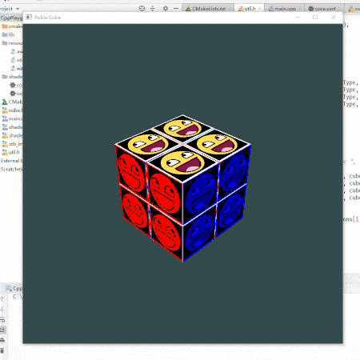

# RubixCube

A simple pocket cube simulator using OpenGL.

## Description

Here is a presentation of the program:



It's written in 2019 as a toy for my Computer Graphics lessons and also serves as a template for OpenGL programming and compiling using `cmake`. I was once annoyed by configuring OpenGL using Visual Studio so used CMake instead.

## Getting Started

Executing the following command to compile:

```
git clone https://github.com/p-joe-99/rubixCube
cd rubixCube/lib
```

and clone OpenGL libraries needed in further compilation:

```
git clone https://github.com/nigels-com/glew
git clone https://github.com/glfw/glfw
git clone https://github.com/g-truc/glm
```

for `glad` lib, generate the source code [here](https://glad.dav1d.de/), download, unzip the file and put it under `lib/glad`. Now everything's set, let's compile:

```
cmake .
cmake --build .
```

